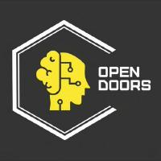

# Diosyunalma

[](https://doi.org/10.5281/zenodo.21864277)
[](LICENSE)

### 🖼️ **[→ Open the gallery: 116 plates and 7 sounds](https://nicoconvoz.github.io/diosyunalma/galeria/)** · **[🏛️ Enter the museum: 244 stops in plain language](https://nicoconvoz.github.io/diosyunalma/galeria/museo.html)**

*Every experiment in this repository draws a plate. They are all here, in one page.*

A laboratory for the arithmetic of the primes — built test-first across a handful of long nights, with a control for every claim, a pre-registration for every hunt, and every correction left visible in the record.

The project began with one question: *is there a relation between all the prime numbers?* The answer it found is a score with layers. The gaps between primes obey an exact parity law whose constants were derived, not fitted — an Euler product for the level, `2 − c₀/c` for the step, the just fourth 4/3 for the destination. The primes themselves are a superposition of waves: **some seventy zeros of nine distinct L-function dials were measured from a single sieve** — ζ's first ten (γ₁ to 0.001%, real parts on the critical line to ±0.003), and the stations of the residue tribes mod 3, 4, 5, 7, 8, 11 and 13, verified against the published tables to within 0.005–0.02 — the mod-5 dial to a depth of fourteen zeros out of fourteen. The primes were then reconstructed *back* from the measured zeros, closing the duality in both directions. And the harmony question — is there one wave compatible with all the tribes? — was answered by demonstration: the summed signal of ζ and the golden tribe carries both musics at once, as the Dedekind zeta of Q(√5) says it must.

**Then the work turned to the Riemann Hypothesis itself**, and stayed there. The
zeros were carried onto the unit disk by the shapeshifter `w = 1 - 1/s`, where
Li's criterion becomes a statement about a single germ at one point; deep-water
engines were built to hunt zeros where float64 gives up — a double-double phase
core certified to t ≈ 4×10²⁴, and a Landsberg–Schaar locomotive that has since
signed water out to 10⁴⁸.

**And the honest result of that campaign is a negative one.** The chain does not
close. The laboratory's own theorems are three proofs that its own methods
cannot suffice: symmetry alone can never decide the question; any shape derived
from the half-cut is provably blind to where a zero actually sits; and no finite
computation can settle it, because the detection horizon runs away as a zero
approaches the line. The Davenport–Heilbronn function — which carries every
symmetry this laboratory proved, and violates the hypothesis anyway — is
reproduced here from scratch, with one of its off-line zeros found by blind
search. It is the clearest evidence that the geometric route is closed.

The full record is in **[docs/FINDINGS.md](docs/FINDINGS.md)**: **271 numbered
findings** (283 entries counting the lettered sub-findings)
with the numbers that produced them and the commands that reproduce them,
killed hypotheses kept on display, and every correction written into the finding
it revises rather than edited away — including the ones the laboratory caught in
its own work, such as the six occasions a perfect `0.0e+00` turned out to come
from the construction instead of from a discovery.

The laboratory today: **213 reproducible experiments** under `cmd/`, **116
plates** and **7 sounds**, **36 measurement techniques** catalogued for reuse,
and a **[244-piece museum](https://nicoconvoz.github.io/diosyunalma/galeria/museo.html)**
that explains every one of them in plain language — each stop closing with its
own block of declared limits. A step-by-step reviewer's guide for independent
validation (in Spanish) is in **[docs/VALIDACION.md](docs/VALIDACION.md)**.

## Quick start

```bash
go run ./cmd/puente   # THE BRIDGE: opens the whole laboratory at localhost:8118
```

One command starts everything: a dashboard listing every experiment in `cmd/`,
grouped by hall, each one launchable with a click, with live output and the
plate it draws shown inline. The gallery of plates is at
**[galeria/index.html](https://nicoconvoz.github.io/diosyunalma/galeria/)**; the journey is documented in
**[docs/RECORRIDO.md](docs/RECORRIDO.md)**.

```bash
go test ./...        # 176 tests across 6 packages, all green
```

Every finding regenerates from a clean checkout. The main experiments:

| command | what it reproduces |
|---------|--------------------|
| `go run ./cmd/lab` | the palindrome parity law and the lag profile |
| `go run ./cmd/residue` | the mod-3 operator law, transition matrix, singular series |
| `go run ./cmd/consecutive` | the cost of adjacency, isolated |
| `go run ./cmd/budget` | every mechanism priced in bits per prime |
| `go run ./cmd/decompose` | the Euler product behind the recurring 0.83 |
| `go run ./cmd/unify` · `cmd/models` | the compounding step factor, and its break |
| `go run ./cmd/octave` | **the step factor derived: E = 2 − c₀/c** |
| `go run ./cmd/tritone` | the sentence on √2: destination 4/3, the just fourth |
| `go run ./cmd/compose` | the mechanism closed: intervals are independent |
| `go run ./cmd/zeta` | **ten zeros of ζ measured from the primes** |
| `go run ./cmd/bridge` | their real parts, and the Li–Hilbert–Pólya bridge |
| `go run ./cmd/operator` | the operator's two fingerprints (census + repulsion) |
| `go run ./cmd/sundial` | **the primes reconstructed from the measured zeros** |
| `go run ./cmd/telescope` | the 10^10 segmented instrument |
| `go run ./cmd/radio` | the gap signal's noise colour (blue: the primes keep a budget) |
| `go run ./cmd/golden` · `cmd/goldenprimes` | φ killed as a number, confirmed as a question |
| `go run ./cmd/wheels` · `cmd/repeats` · `cmd/bags` | the wheels unmasked, and the true second-order layer |
| `go run ./cmd/radio3` · `cmd/radios` | **the tribes' own stations, and the harmony dial** |
| `go run ./cmd/symphony` | mod 7, the tribe of Q(√2), and the asymmetric complex dial |
| `go run ./cmd/conductor` · `cmd/baton` | **the conductor: orthogonality's baton, then sharpened** |
| `go run ./cmd/song` | **the whole orchestra at once, rendered as audio** |
| `go run ./cmd/nuclear` | **Montgomery's pair correlation: the stations keep nuclear statistics** |
| `go run ./cmd/orbits` | **Landau's roll call: the primes as periodic orbits** |
| `go run ./cmd/flanks` | the F32 mystery resolved: the flanks' hidden correlation |
| `go run ./cmd/blanket` | **the inverse problem: an atom woven from the measured notes** |
| `go run ./cmd/chest` | the repetition anomaly's signature; two candidate keys killed |
| `go run ./cmd/duet` | **the harmony's atom: one well singing two tribes' interleaved song** |
| `go run ./cmd/tutti` | **the tutti: one atom for all ten dials — seventy notes with `-top 22.9`** |
| `go run ./cmd/pond` | wave chaos: the stadium pond repels, the circular pond relaxes |
| `go run ./cmd/firstpass` | the first-pass probes, killed hypotheses included |
| `go run ./cmd/oscillation` · `cmd/constellation` | bounds and kills, kept reproducible |

Defaults run in seconds to minutes; the heavy hunts take `-limit 1000000000` and up.

## Layout

The structure is the method:

```
primes/       the raw data — sieves (flat and segmented), gaps, residues, ψ
pattern/      detectors — palindromes, lags, laws, reversal pairs, Gilbreath
control/      the refuter — shuffled-gap decoys, Cramér and odd decoys, 5σ scoring
information/  the currency — entropy, mutual information, bits per prime
spectral/     the ear — periodograms over unevenly sampled series
riemann/      the bridge — Li sums, zero counting, the prime clock
cmd/          the experiments, one command per finding
```

A detector's count proves nothing by itself: `control/` exists to ask how many a structureless sequence would have produced, and nothing enters the findings record without that comparison. Significance requires |z| > 5. Expected results are pre-registered in the source before the data is looked at. Corrections are written into the findings they revise, never edited away — and hypotheses the data killed (seven so far) stay in the record, reproducible, because a findings document that can only re-run its survivors is a sales brochure.

Three lessons the record keeps returning to:

- **Sigma measures certainty; bits measure value; only decomposition measures novelty of mechanism.** A 14σ effect turned out to be worth 0.002 bits; a z of −548 reduced to bookkeeping under one identity.
- **Constants that drift are stations, not destinations.** The tritone √2, the inverse golden ratio and 5/4 all lie on measured routes that cross them and keep going.
- **A control that misbehaves is the fastest way to notice the telescope is broken.** Two instruments were discarded mid-session because their decoys bounced.

## The one-sentence summary

The primes look like noise, keep a budget, obey an exact mirror law with
derivable constants, behave like the spectrum of an operator nobody has found,
and sing — one song per tribe, some seventy measured notes across nine dials;
and when the same instruments were turned on the Riemann Hypothesis itself, they
produced three proofs that they are not enough to settle it. All from a laptop,
test-first, with every kill and every correction left in the record.

---

## Funding



This work is **funded by Open Doors**.

## What this claims — and what it does not

This laboratory publishes **measurements, instruments and visualisations of
known mathematics**, plus a number of original instruments. **No proof of the
Riemann Hypothesis is claimed here.** Every result carries its stated limit
beside it, and the laboratory's own errors are published alongside its
successes — including the ones it caught in its own work.

## Licence

Two licences, because code and content are different things:

| What | Licence | File |
|---|---|---|
| **The code** — everything under `cmd/` and any Go source | **AGPL-3.0** | [LICENSE](LICENSE) |
| **The code, for closed/commercial use** | **Commercial licence** | [LICENCIA-COMERCIAL.md](LICENCIA-COMERCIAL.md) |
| **Copyright notice and ownership** | — | [NOTICE](NOTICE) |
| **The content** — `galeria/` (plates and sounds), `docs/` (logbook, findings, technical report, the museum) and the explanatory texts | **CC BY 4.0** | [LICENSE-CONTENIDO.txt](LICENSE-CONTENIDO.txt) |

To cite a plate, a text or a finding:

```
Jesús Nicolás Astorga and RESOURCES OPEN DOORS S.A.S, "Laboratorio Diosyunalma", 2026.
https://doi.org/10.5281/zenodo.21864277
CC BY 4.0 (https://creativecommons.org/licenses/by/4.0/)
```

Full details, in Spanish, in **[LICENCIAS.md](LICENCIAS.md)**.

The bridge is a network service, so **AGPL section 13** applies: it serves its
own corresponding source at `/fuente` and `/fuente.zip` while running. If those
terms do not suit your use — closed products, SaaS without publishing your
source — a commercial licence is available.

**Third-party dependencies: none.** `go.mod` carries no `require` line — the
whole laboratory is built on the Go standard library.

